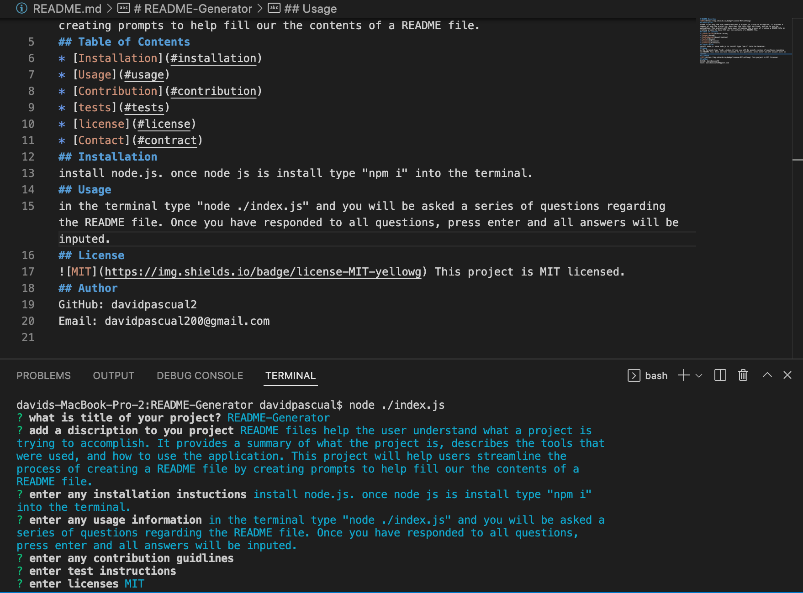
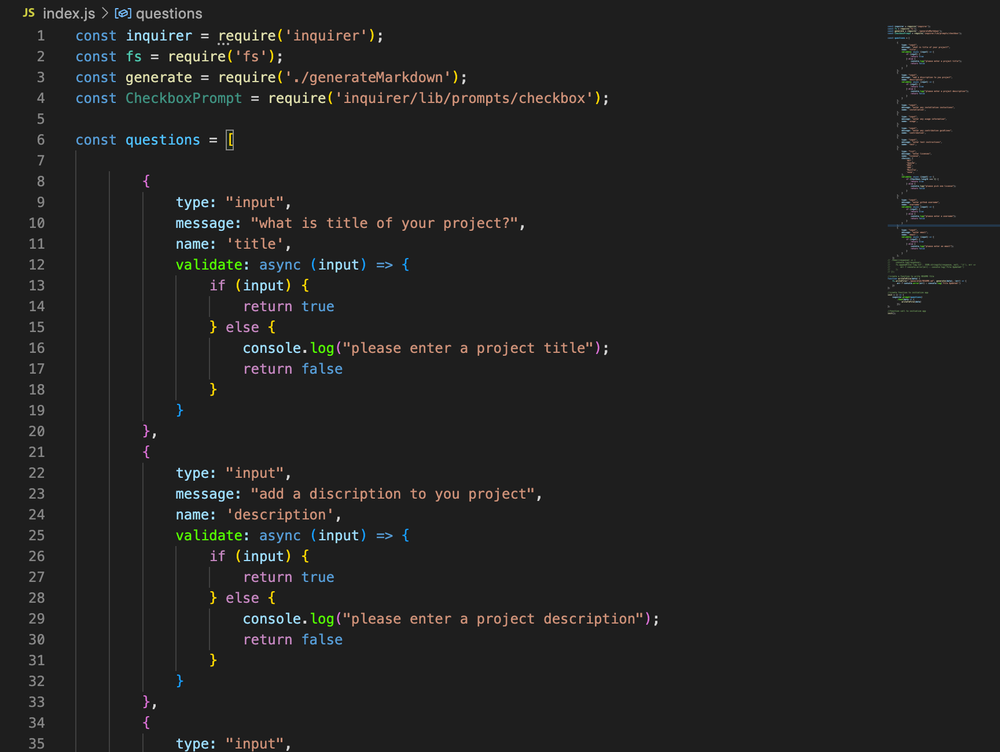

# README-Generator

## Description
README files help the user understand what a project is trying to accomplish. It provides a summary of what the project is, describes the tools that were used, and how to use the application. This project will help users streamline the process of creating a README file by creating prompts to help fill our the contents of a README file. 
## Table of Contents
* [Installation](#installation)
* [Usage](#usage)
* [Contribution](#contribution)
* [tests](#tests)
* [license](#license)
* [Contact](#contract)
## Installation
install node.js. once node js is install type "npm i" into the terminal.
## Usage
in the terminal type "node ./index.js" and you will be asked a series of questions regarding the README file. Once you have responded to all questions, press enter and all answers will be inputed. 
## License
 This project is MIT licensed.
## Preview

## Author
- GitHub: davidpascual2
- Email: davidpascual200@gmail.com
